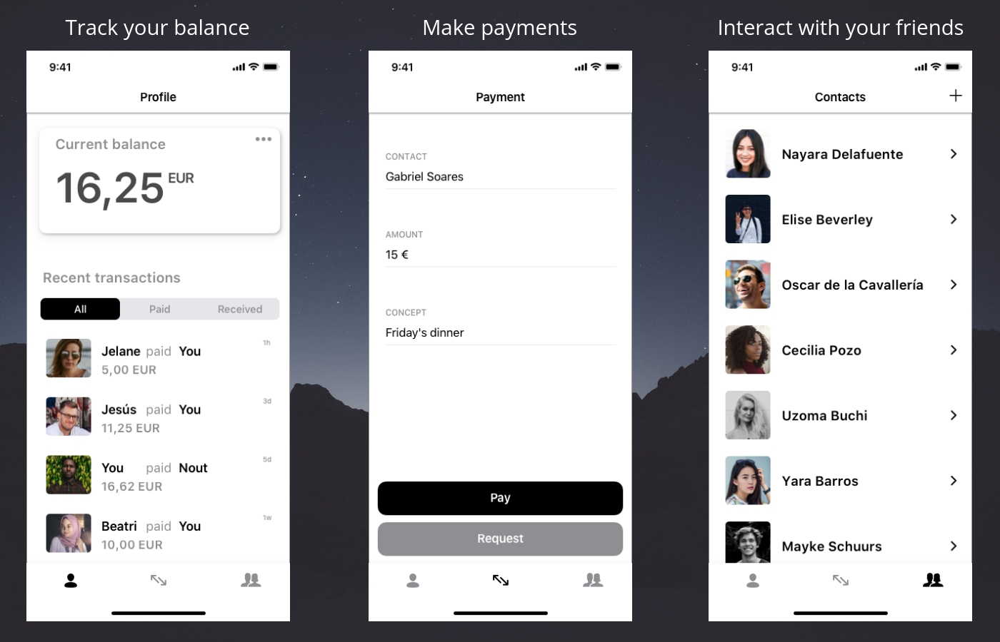

# Pay or Die

This project is a concept of a peer to peer payment app.

## Preguntas

### **Explica las decisiones más importantes que has tomado y que consideres más importante. Máximo dos párrafos.**
Una de las decisiones más importantes a la hora de plantear el diseño, fue la elección de los colores. Como estaba un poco inseguro en qué variedades cromáticas elegir (se me habían ocurrido tonalidades azules, dada la temática de la app, ya que dan seguridad y comfort) escogí unas tonalidades básicas, con fondo blanco y donde predomina el negro. Este color negro dota de un aspecto de elegancia y seguridad. En aquellas zonas donde el usuario tiene que interactuar con la aplicación, vemos como el color escogido es el negro. También hice uso del relieve para reforzar una zona de interacción

Quizás no haya sido la mejor decisión a la hora de escoger el color, pero en general buscaba una sensación de sencillez y elegancia, y creo que el color negro transmite esas sensaciones.

La segunda decisión, y en mi opinión, la misma importante, es la de incluir la pantalla de pagos en el TabBar. Como el objetivo de esta aplicación, es el intercambio de dinero, creo que la pantalla que nos dé esa funcionalidad, tiene que ser una parte con mucho peso en la aplicación, y así lo intenté resolver.

### **Desde el punto de vista humano, ¿que cuestiones crees que son clave?. Desarrollar en un solo un párrafo.**

En mi opinión, las cuestiones claves de la aplicación son: la intuitividad de uso, el correcto uso de los colores, y la sencillez de la interfaz.

### **¿Qué onboarding crees que sería el adecuado? Desarrollar en un solo un párrafo.**

Un onboarding que podría funcionar para este tipo de aplicación, sería uno donde se le explique al usuario las funcionalidades claves de la aplicación, en tres o cuatro pantallas. Yo destacaría las siguientes funcionalidades:
- Poder añadir amigos
- Llevar un seguimiento de las últimas operaciones
- Poder realizar traspasos de dinero entre contactos